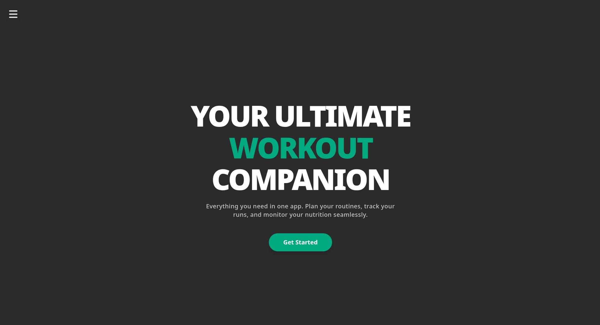

# 🏋️ Gymmer - College Project Assignment

## 📖 Overview
**Gymmer** is a comprehensive multi-tier application designed to handle gym and fitness management. It spans several domains of software engineering, incorporating a mobile app, a web dashboard, and computer vision capabilities—specifically featuring photo recognition for both food and gym machines.

## 📸 Gallery

## 🛠️ Tech Stack
* **Frontend (Web):** React, JavaScript, TypeScript
* **Frontend (Mobile):** React Native
* **Backend:** Python, FastAPI
* **Containerization:** Docker, Docker Compose

## 📂 Repository Structure
* **`NPO/`** - Advanced Object-Oriented Programming components.
* **`ORV/`** - Computer Vision implementations, including the food and machine recognition algorithms.
* **`RAI/`** - Core application directory containing the Web App, Mobile App, and the Python Backend.
* **`docs/`** - Relevant project documentation and assignment instructions.

## ⚙️ Prerequisites
Ensure your local environment has the following installed:
* Docker and Docker Compose
* Node.js & npm 
* Python 3.x

## 🚀 Getting Started

The project is fully containerized. To initialize the application and start all the Docker containers, use the provided Python setup script:

### Primary Method: Python Setup Script
1. Clone the repository: `git clone https://github.com/leoncvenk/Project-Assignment-Gymmer.git`
2. Navigate into the directory: `cd Project-Assignment-Gymmer`
3. Run the setup script: `python start_project.py`

This script will automatically execute and spin up all necessary Docker containers for the project.

### Docker Compose
If you prefer to run the containers manually, use the following command from the root directory:
`docker-compose up --build`

## 👨‍💻 Development & CI/CD
Code quality is enforced via Git hooks managed by Husky. Continuous integration standards are automatically checked upon code pushes using GitHub Actions workflows located in `.github/workflows/`.

## 📄 License
This project is available under the [MIT License](LICENSE).
